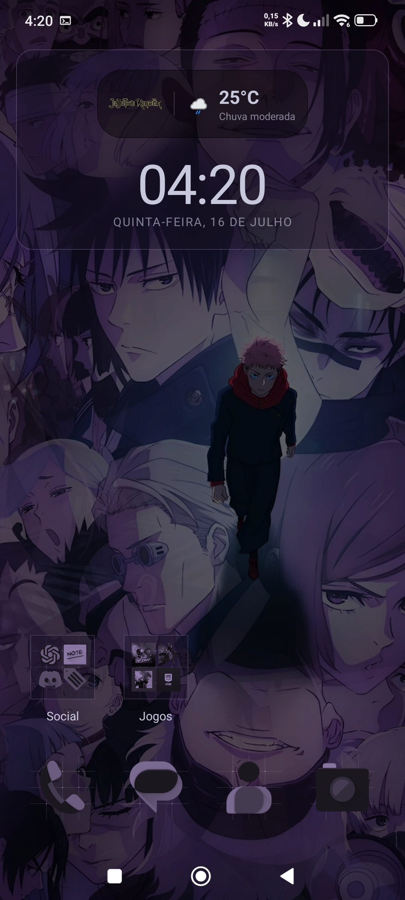
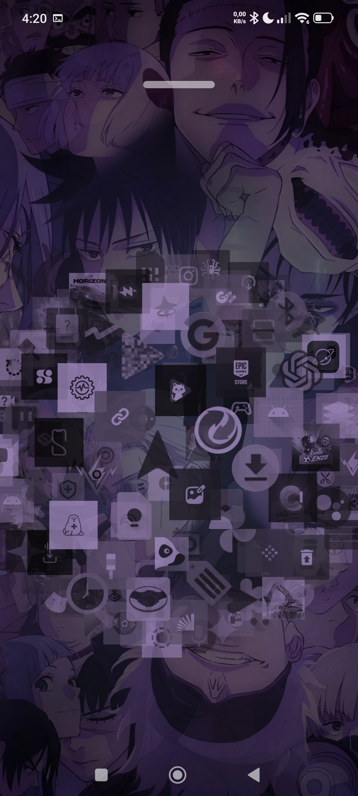
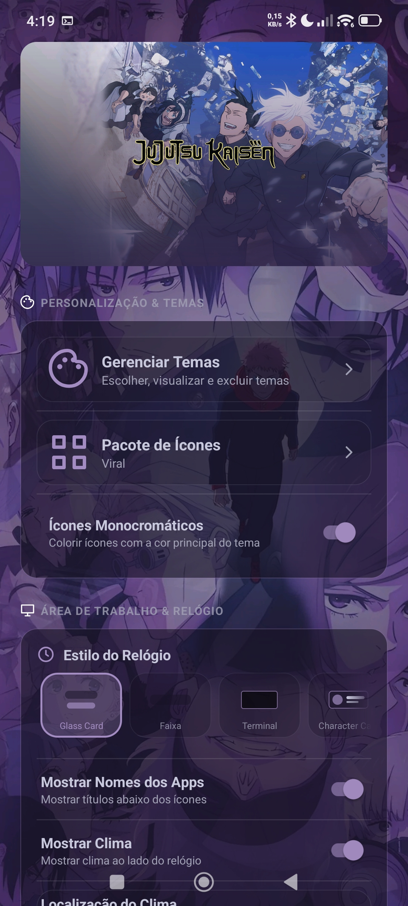
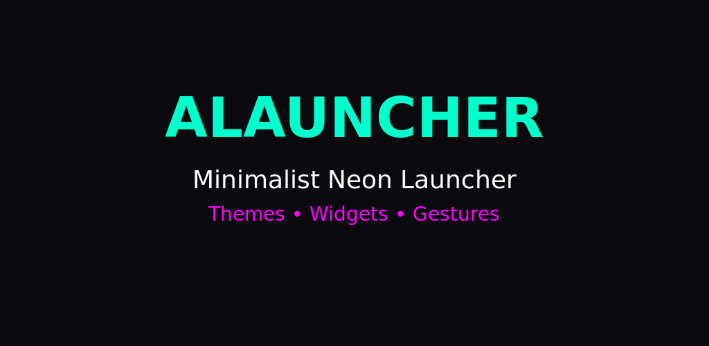

<div align="center">

# Alauncher

### Minimalist Neon Launcher for Android

[](https://www.gnu.org/licenses/gpl-3.0)
[](https://developer.android.com/about/versions/oreo)
[](https://f-droid.org)

A clean, futuristic launcher with dynamic neon themes, fluid gestures and full widget support.

[Download](https://github.com/Alisuuu/alauncher/releases) • [Theme Store](https://alauncher.netlify.app/) • [Report Bug](https://github.com/Alisuuu/alauncher/issues)

</div>

---

## Screenshots

<div align="center">

| | |
|:---:|:---:|
| **Home Screen** | **App Drawer** |
|  |  |
| **Widgets** | **Settings** |
|  |  |

</div>

---

## Features

### Themes & Personalization
- Dynamic neon and minimalist themes
- Import custom themes from the Theme Store
- Icon pack support with monochromatic tinting
- Customizable clock styles (digital, analog, strip)
- Configurable icon sizes and card shapes

### Desktop & Widgets
- Full Android widget support
- Music player widget with MediaSession (Spotify, YouTube Music, etc.)
- Weather display on home screen
- Quick notes widget
- Drag & drop to organize apps and create folders

### Gestures & Navigation
- Fluid gesture navigation
- Orbital and standard app drawer styles
- Double tap to sleep
- Global search with app and contact results

### System
- Tablet and landscape mode support
- Material Design with smooth animations
- Lightweight and fast
- No ads, no tracking, no data collection

---

## Theme Store

Create and share custom themes at **[alauncher.netlify.app](https://alauncher.netlify.app/)**

<div align="center">



</div>

- Build themes from scratch with the online editor
- Import themes directly into Alauncher
- Browse and download community themes

---

## Building

### Requirements
- Android Studio Hedgehog or newer
- JDK 17
- Android SDK 35

### Build

```bash
# Clone the repository
git clone https://github.com/Alisuuu/alauncher.git
cd alauncher

# Build debug APK
./gradlew assembleDebug

# Build release APK
./gradlew assembleRelease
```

The APK will be generated in `app/build/outputs/apk/`

---

## Installing from F-Droid

Alauncher is available on F-Droid for automatic updates.

<a href="https://f-droid.org/packages/com.alisu.alauncher/">

</a>

---

## License

```
Copyright (C) 2024 Alisuuu

This program is free software: you can redistribute it and/or modify
it under the terms of the GNU General Public License as published by
the Free Software Foundation, either version 3 of the License, or
(at your option) any later version.
```

See [LICENSE](LICENSE) for details.

---

<div align="center">

**If you like Alauncher, give it a star!**

</div>
